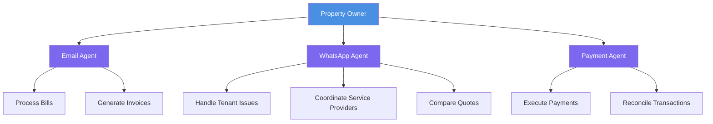
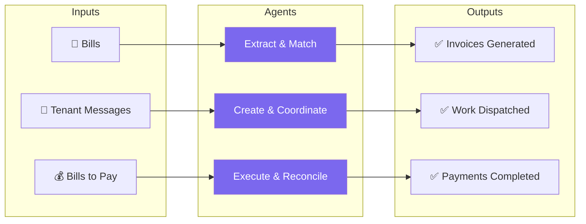

# Feature & Functionality Diagram Suggestions

## Recommended Diagrams

### Option 1: **Autonomous Agent Ecosystem** (Recommended)
**Type:** System Architecture / Feature Overview Diagram

**Purpose:** Shows all the autonomous agents and what they handle, visually demonstrating the scope of automation

**Visual Concept:**
```
                    [Property Owner]
                          |
        ┌─────────────────┼─────────────────┐
        |                 |                 |
   [Email Agent]    [WhatsApp Agent]   [Payment Agent]
        |                 |                 |
   ┌────┴────┐      ┌─────┴─────┐     ┌─────┴─────┐
   |         |      |           |     |           |
Bills    Invoices  Tenant    Service  Execute   Reconcile
         |         Issues    Provider |          |
         |         |         Quotes    |          |
         └─────────┴─────────┴────────┴──────────┘
                    |
            [Autonomous Decision Making]
```

**What it shows:**
- Three main agent types (Email, WhatsApp, Payment)
- What each agent handles
- How they connect to property owner
- The autonomous decision-making layer

**Why it works:**
- High-level overview
- Shows breadth of capabilities
- Visual representation of "agents acting on your behalf"
- Easy to understand at a glance

---

### Option 2: **End-to-End Automation Flow** (Recommended)
**Type:** Process Flow Diagram

**Purpose:** Shows the complete journey from problem to solution, highlighting autonomous execution

**Visual Concept:**
```
┌─────────────────────────────────────────────────────────────┐
│                    AUTONOMOUS PROPERTY MANAGEMENT            │
└─────────────────────────────────────────────────────────────┘

INPUTS                    AGENTS                    OUTPUTS
┌──────────┐         ┌──────────────┐         ┌──────────────┐
│ 📧 Bills │────────▶│  Extract &   │────────▶│  Invoices    │
│          │         │   Match      │         │  Generated   │
└──────────┘         └──────────────┘         └──────────────┘

┌──────────┐         ┌──────────────┐         ┌──────────────┐
│ 💬 Tenant│────────▶│  Create &    │────────▶│  Work        │
│ Messages │         │  Coordinate   │         │  Dispatched  │
└──────────┘         └──────────────┘         └──────────────┘

┌──────────┐         ┌──────────────┐         ┌──────────────┐
│ 💰 Bills │────────▶│  Execute &   │────────▶│  Payments    │
│ to Pay   │         │  Reconcile   │         │  Completed   │
└──────────┘         └──────────────┘         └──────────────┘

                    [All Within Guardrails]
```

**What it shows:**
- Three main input types (Bills, Tenant Messages, Payments)
- What agents do (Extract, Coordinate, Execute)
- Final outcomes
- Guardrails concept

**Why it works:**
- Shows complete automation loop
- Demonstrates "agents acting on your behalf"
- Clear input → process → output
- Professional and clean

---

### Option 3: **Agent Capabilities Matrix** (Alternative)
**Type:** Feature Matrix / Capability Diagram

**Purpose:** Shows what each agent can do autonomously

**Visual Concept:**
```
┌────────────────────────────────────────────────────────────┐
│           AUTONOMOUS AGENT CAPABILITIES                   │
├────────────────────────────────────────────────────────────┤
│                                                             │
│  📧 EMAIL AGENT          💬 WHATSAPP AGENT    💰 PAYMENT   │
│  ──────────────          ────────────────      AGENT        │
│  • Process bills         • Receive tenant     • Execute    │
│  • Extract data            messages              payments    │
│  • Navigate portals     • Create incidents   • Reconcile   │
│  • Match to periods     • Send RFQs          • Audit trail │
│  • Generate invoices    • Compare quotes     • Guardrails  │
│                          • Dispatch work                    │
│                                                             │
│  All agents operate autonomously within defined guardrails │
│                                                             │
└────────────────────────────────────────────────────────────┘
```

---

## Recommended Approach: Use Both Option 1 & Option 2

### Diagram 1: **Autonomous Agent Ecosystem** (High-level overview)
- Place after "Autonomous Agents That Actually Work" section
- Shows the breadth and scope
- Visual representation of the agent network

### Diagram 2: **End-to-End Automation Flow** (Process view)
- Place after "WhatsApp Automation" or "Delegated Payments" section
- Shows the complete automation journey
- Demonstrates autonomous execution

---

## Mermaid Code Examples

### Diagram 1: Autonomous Agent Ecosystem


### Diagram 2: End-to-End Automation Flow


---

## Simplified Visual Options (If Mermaid doesn't render well)

### Option A: Icon-Based Feature Diagram
```
┌─────────────────────────────────────────────────────┐
│                                                      │
│   📧 Email Automation    💬 WhatsApp Automation   │
│   • Bill Processing      • Tenant Communication    │
│   • Data Extraction      • Service Provider RFQs   │
│   • Invoice Generation   • Quote Comparison       │
│                                                      │
│   💰 Payment Automation   🤖 Autonomous Agents      │
│   • Execute Payments     • Make Decisions          │
│   • Reconcile Accounts   • Act on Your Behalf       │
│   • Guardrails & Audit   • Within Boundaries       │
│                                                      │
└─────────────────────────────────────────────────────┘
```

### Option B: Central Hub Diagram
```
                    [Autonomous Agents]
                           |
        ┌──────────────────┼──────────────────┐
        |                  |                  |
   📧 Email          💬 WhatsApp        💰 Payment
   Processing       Coordination      Execution
        |                  |                  |
   ┌────┴────┐       ┌─────┴─────┐      ┌────┴────┐
   Bills  Invoices  Tenant  Service   Execute Reconcile
          |         Issues  Providers  |        |
          └──────────┴──────────┴──────┴────────┘
                    All Automated
```

---

## Final Recommendation

**Use 2 diagrams:**

1. **Autonomous Agent Ecosystem** (Diagram 1)
   - Shows the three main agent types and their capabilities
   - Place early in the post (after "Autonomous Agents That Actually Work")
   - Demonstrates scope and breadth

2. **End-to-End Automation Flow** (Diagram 2)
   - Shows the complete journey from inputs to outputs
   - Place later (after "WhatsApp Automation" or "Delegated Payments")
   - Demonstrates autonomous execution

Both diagrams are:
- Easy to understand at a glance
- Professional and clean
- Focus on features/capabilities, not technical implementation
- Visual representation of "agents acting on your behalf"

