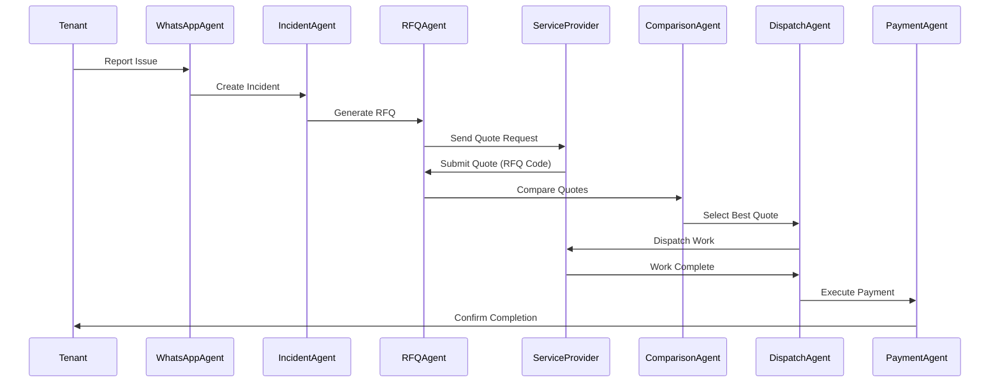
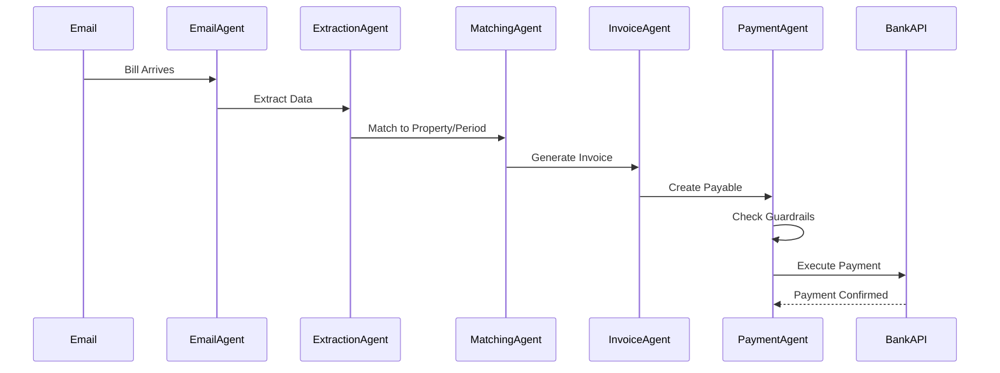
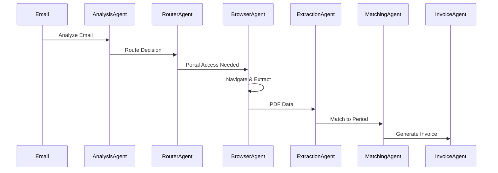

# Sequence Diagram Suggestions for LinkedIn Post

## Recommended Sequence Diagrams

### 1. **Bill-to-Payment Autonomous Flow** ⭐ (High Priority)
**Purpose:** Shows the complete autonomous workflow from bill arrival to payment execution

**Why it's valuable:**
- Demonstrates end-to-end automation without human intervention
- Shows how multiple sub-agents collaborate
- Highlights the "agents acting on your behalf" theme
- Visual representation of the core value proposition

**Flow:**
```
Email/Bill → Email Agent → Extraction Agent → Matching Agent → Invoice Agent → Payment Agent → Bank API
```

**Key moments to highlight:**
- Agentic browser navigating portals autonomously
- Automatic extraction and matching
- Payment execution without manual approval (within guardrails)

---

### 2. **WhatsApp Service Provider Workflow** ⭐ (High Priority)
**Purpose:** Shows the complete tenant-to-service-provider-to-payment flow

**Why it's valuable:**
- Most impressive and relatable workflow
- Shows multi-party coordination (tenant, agents, service providers)
- Demonstrates autonomous decision-making (quote comparison, selection)
- Shows the "delegation at scale" concept visually

**Flow:**
```
Tenant WhatsApp → Incident Agent → RFQ Agent → Service Providers → Quote Comparison Agent → Dispatch Agent → Payment Agent
```

**Key moments to highlight:**
- Automatic RFQ code generation and distribution
- Quote collection and comparison
- Autonomous selection and dispatch
- Payment execution after work completion

---

### 3. **Sub-Agent Architecture Interaction** (Medium Priority)
**Purpose:** Shows how specialized agents collaborate within a single workflow

**Why it's valuable:**
- Explains the technical architecture in an accessible way
- Demonstrates the "network of specialized agents" concept
- Shows how agents make decisions and hand off to each other

**Flow:**
```
Email → Analysis Agent → Router Agent → [Extraction Agent | Browser Agent | Matching Agent] → Invoice Agent → Payment Agent
```

**Key moments to highlight:**
- Agent decision-making (which agent handles what)
- Agent-to-agent communication
- Parallel processing capabilities

---

### 4. **Delegated Payment Execution with Guardrails** (Medium Priority)
**Purpose:** Shows how payments are executed safely with guardrails

**Why it's valuable:**
- Addresses the "trust" concern directly
- Shows security and guardrail mechanisms
- Demonstrates how agents operate within boundaries
- Relevant for Capital Markets audience

**Flow:**
```
Payable Instance → Guardrail Check → Credential Decryption → Payment API → Audit Trail → Reconciliation Agent
```

**Key moments to highlight:**
- Guardrail validation before payment
- Secure credential handling
- Audit trail creation
- Automatic reconciliation

---

### 5. **Intelligent Bank Account Reconciliation** (Lower Priority)
**Purpose:** Shows automated reconciliation workflow

**Why it's valuable:**
- Demonstrates "intelligent bank accounts" concept
- Shows proactive financial management
- Less critical but supports the future vision

**Flow:**
```
Bank Statement → Transaction Agent → Matching Agent → Invoice Agent → Reconciliation Report → Anomaly Detection
```

---

## Recommended Approach

### For LinkedIn Post (Visual Impact):
**Include 2-3 diagrams maximum** to keep the post engaging:

1. **WhatsApp Service Provider Workflow** - Most impressive and relatable
2. **Bill-to-Payment Autonomous Flow** - Core value proposition
3. **Delegated Payment Execution** - Addresses trust/security (if space allows)

### Diagram Style Recommendations:

**Option A: Simplified Business Flow**
- Focus on high-level agent interactions
- Use clear labels: "Email Agent", "Payment Agent", etc.
- Show decision points and parallel flows
- Keep technical details minimal

**Option B: Technical Architecture**
- Show sub-agent interactions in detail
- Include guardrails and security checkpoints
- Show data flow between agents
- More technical but demonstrates sophistication

**Option C: Hybrid**
- Start with simplified flow
- Add callout boxes for key technical details
- Best of both worlds

---

## Mermaid Syntax Examples

### Example 1: WhatsApp Workflow (Simplified)


### Example 2: Bill-to-Payment Flow (Simplified)


### Example 3: Sub-Agent Architecture (Technical)


---

## Implementation Notes

1. **Placement in Post:**
   - After the relevant section text
   - Use as visual breaks between sections
   - Can be embedded or linked (LinkedIn supports Mermaid in some contexts)

2. **Alternative Formats:**
   - If Mermaid doesn't render well on LinkedIn, export as images
   - Use tools like: Mermaid Live Editor, Draw.io, or Excalidraw
   - Keep diagrams simple and readable on mobile

3. **Accessibility:**
   - Add alt text descriptions
   - Use high contrast colors
   - Ensure readability at small sizes

---

## Priority Ranking

1. ⭐⭐⭐ **WhatsApp Service Provider Workflow** - Most impressive, shows full automation
2. ⭐⭐⭐ **Bill-to-Payment Autonomous Flow** - Core value, shows agents acting independently
3. ⭐⭐ **Delegated Payment Execution** - Addresses trust, relevant for financial audience
4. ⭐ **Sub-Agent Architecture** - Technical detail, less essential for LinkedIn audience
5. ⭐ **Reconciliation Flow** - Supporting detail, can be mentioned without diagram

---

## Questions to Consider

1. **Target Audience:** More technical (include architecture diagrams) or business-focused (simplified flows)?
2. **Visual Style:** Professional/clean or more dynamic/engaging?
3. **Detail Level:** High-level flows or technical implementation details?
4. **Platform:** Will these render on LinkedIn, or need to be exported as images?

