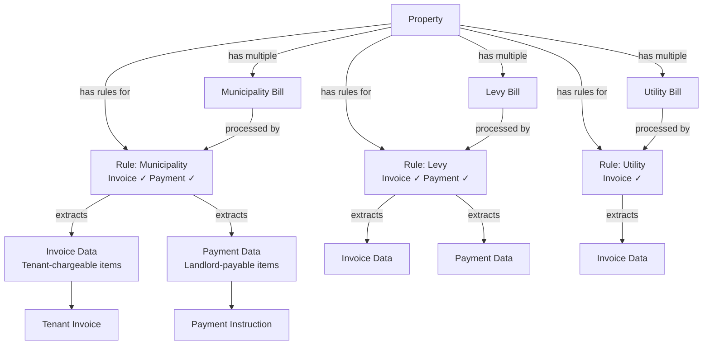

# Data Flow: Property-Rules-Bills Relationship

## Overview

This document explains the relationship between properties, bills, extraction rules, and their outputs in the rental agent automation system.

## Core Relationships

### 1. Property → Rules (One-to-Many)
- **Rules are property-specific**: Each property has its own set of extraction rules
- **Multiple rules per property**: A property can have multiple rules for different bill types (municipality, levy, utility, other)
- **Rule scope**: Rules cannot be shared across properties

### 2. Property → Bills (One-to-Many)
- **Multiple bills per property**: A property receives multiple bills over time
- **Different bill types**: Bills can be municipality bills, levy statements, utility bills, or other types
- **Multiple sources**: Bills can come from email forwarding or manual upload

### 3. Bill → Rules (Many-to-Many)
- **One or two rules per bill**: Each bill is processed by one or two rules:
  - **Invoice Rule**: Extracts tenant-chargeable items (water, electricity, sewerage)
  - **Payment Rule**: Extracts landlord-payable items (levies, fees, beneficiary details)
- **Same rule for both**: A single rule can extract both invoice and payment data from the same bill
- **Different rules**: Separate rules can be used for invoice and payment extraction
- **Rule matching**: Rules are matched by property, bill type, and output type flags

### 4. Bill → Outputs (One-to-Two)
- **Dual outputs**: Each bill produces two types of extracted data:
  - **Invoice Extraction Data**: Tenant-chargeable items stored in `invoiceExtractionData`
  - **Payment Extraction Data**: Landlord-payable items stored in `paymentExtractionData`
- **Optional outputs**: Not all bills produce both outputs (depends on rule configuration)

### 5. Rule → Outputs (One-to-Two)
- **Flexible output configuration**: Each rule can be configured to extract:
  - Invoice data only (`extractForInvoice = true`)
  - Payment data only (`extractForPayment = true`)
  - Both invoice and payment data (both flags = true)
- **Separate configs**: Each output type has its own extraction configuration:
  - `invoiceExtractionConfig`: JSON config for invoice extraction
  - `paymentExtractionConfig`: JSON config for payment extraction

## Data Flow Diagram

## Processing Flow

### Step 1: Bill Creation
1. Bill is uploaded (manual) or received via email
2. Bill is linked to a property
3. Bill type is determined (municipality, levy, utility, other)
4. Bill status is set to "pending"

### Step 2: Rule Matching
1. System finds active rules for the property and bill type
2. Finds rule(s) with `extractForInvoice = true` (if any)
3. Finds rule(s) with `extractForPayment = true` (if any)
4. If same rule extracts both, use it for both purposes
5. If different rules, use separate rules

### Step 3: PDF Processing
1. PDF is uploaded to OpenAI Files API
2. For invoice extraction (if rule exists):
   - Uses `invoiceExtractionConfig` from the invoice rule
   - Extracts tenant-chargeable items
   - Stores in `invoiceExtractionData`
3. For payment extraction (if rule exists):
   - Uses `paymentExtractionConfig` from the payment rule
   - Extracts landlord-payable items
   - Stores in `paymentExtractionData`

### Step 4: Rule Tracking
1. `invoiceRuleId` is stored (rule used for invoice extraction)
2. `paymentRuleId` is stored (rule used for payment extraction)
3. These can be the same rule ID if a single rule extracts both

### Step 5: Downstream Actions
1. **Invoice Data** → Creates variable costs for tenants (if property is postpaid)
2. **Payment Data** → Creates payment records for landlord execution

## Example Scenarios

### Scenario 1: Municipality Bill with Both Outputs
- **Property**: "123 Main Street"
- **Bill**: Municipality bill PDF
- **Rule**: "Municipality Bill Rule" (extracts both invoice and payment)
  - `extractForInvoice = true`
  - `extractForPayment = true`
- **Result**:
  - `invoiceExtractionData`: Water and electricity charges for tenants
  - `paymentExtractionData`: Municipality fees and levies for landlord
  - `invoiceRuleId` and `paymentRuleId`: Same rule ID

### Scenario 2: Levy Bill with Separate Rules
- **Property**: "456 Oak Avenue"
- **Bill**: Body corporate levy statement
- **Rules**:
  - "Levy Invoice Rule" (extracts invoice only)
  - "Levy Payment Rule" (extracts payment only)
- **Result**:
  - `invoiceExtractionData`: Tenant utilities from levy statement
  - `paymentExtractionData`: Body corporate levy for landlord
  - `invoiceRuleId` and `paymentRuleId`: Different rule IDs

### Scenario 3: Utility Bill with Invoice Only
- **Property**: "789 Pine Road"
- **Bill**: Utility bill PDF
- **Rule**: "Utility Bill Rule" (extracts invoice only)
  - `extractForInvoice = true`
  - `extractForPayment = false`
- **Result**:
  - `invoiceExtractionData`: Water and electricity for tenants
  - `paymentExtractionData`: null
  - `invoiceRuleId`: Rule ID
  - `paymentRuleId`: null

## Database Schema

### extraction_rules Table
- `propertyId` (required): Links rule to property
- `extractForInvoice` (boolean): Whether rule extracts invoice data
- `extractForPayment` (boolean): Whether rule extracts payment data
- `invoiceExtractionConfig` (jsonb): Config for invoice extraction
- `paymentExtractionConfig` (jsonb): Config for payment extraction
- `billType`: Type of bill this rule processes

### bills Table
- `propertyId` (required): Links bill to property
- `billType`: Type of bill (municipality, levy, utility, other)
- `invoiceExtractionData` (jsonb): Extracted tenant-chargeable items
- `paymentExtractionData` (jsonb): Extracted landlord-payable items
- `invoiceRuleId`: Rule used for invoice extraction
- `paymentRuleId`: Rule used for payment extraction

## Key Design Decisions

1. **Property-Specific Rules**: Rules are tied to properties to allow different extraction logic per property
2. **Dual-Purpose Extraction**: Single rule can extract both outputs to reduce configuration overhead
3. **Separate Configs**: Each output type has its own config for flexibility
4. **Rule Tracking**: Bills track which rules were used for transparency and debugging
5. **Flexible Matching**: System handles both single-rule and dual-rule scenarios

## UI Flow

1. **Property Detail Page**: Shows all bills and rules for a property
2. **Bill Detail Page**: Shows extraction results and which rules were used
3. **Rule Builder**: Allows selecting output types (invoice, payment, or both) with separate configs
4. **Rules List**: Shows output type badges (Invoice, Payment, or both)

