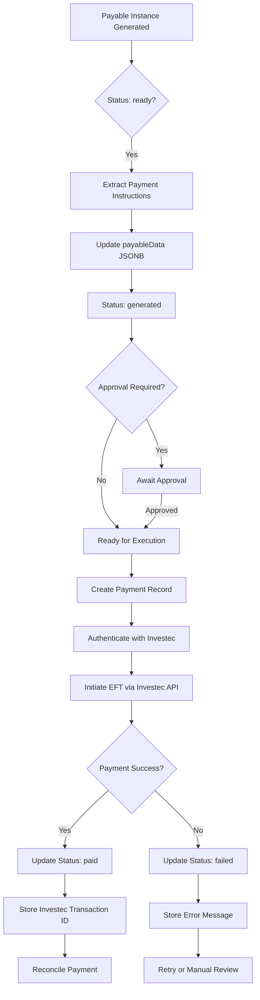

# Investec Payment Integration Guide

## Overview

This document explains how the payables payment process will work using Investec's Open Banking API. The integration enables automated EFT (Electronic Funds Transfer) payments for generated payables, from payment instruction generation through to execution and reconciliation.

## Current Payables Flow

### 1. Payable Generation
- **Payable Templates** define the structure of payables (e.g., "Body Corporate Levy Payment")
- **Payable Schedules** define when payables should be generated (e.g., 15th of each month)
- **Payable Instances** are the actual generated payables with status: `pending` → `ready` → `generated` → `paid`

### 2. Payment Instruction Generation
When a payable instance reaches `ready` status:
- Payment instructions are extracted from contributing bills via extraction rules
- Payment data is stored in `payableData` JSONB field on `payable_instances` table
- Payment instructions include:
  - Beneficiary name
  - Account number
  - Bank code/branch code
  - Amount
  - Payment reference
  - Scheduled payment date

### 3. Payment Execution
Once payment instructions are generated, payables move to `generated` status and are ready for payment execution via Investec API.

## Investec API Integration Flow

### Architecture Overview



### Step-by-Step Process

#### Phase 1: Payment Instruction Generation

1. **Payable Instance Creation**
   - Payable instances are generated when dependencies are met (contributing bills are processed)
   - Initial status: `pending` or `ready`
   - `payableData` field is initially `null`

2. **Payment Data Extraction**
   - When status is `ready`, payment instructions are extracted from contributing bills
   - Extraction uses `paymentExtractionConfig` from extraction rules
   - Extracted data structure:
   ```typescript
   {
     beneficiaryName: string
     beneficiaryAccountNumber: string
     beneficiaryBankCode: string // Branch code or bank routing code
     amount: number
     currency: "ZAR"
     reference: string // Payment reference (e.g., account number, invoice number)
     scheduledDate: string // ISO date
   }
   ```
   - This data is stored in `payableData` JSONB field
   - Status updated to `generated`

#### Phase 2: Payment Preparation

3. **Payment Record Creation**
   - When a payable instance is `generated` and ready for payment, create a payment record
   - Link payment to payable instance (via `payableInstanceId` foreign key)
   - Payment status: `pending`
   - Approval status: `pending` (if approval required based on amount threshold)

4. **Payment Approval (Optional)**
   - If payment amount exceeds threshold (e.g., > R10,000), require approval
   - User reviews payment details and approves/rejects
   - Upon approval, payment status moves to `approved`

#### Phase 3: Investec API Authentication

5. **OAuth 2.0 Authentication**
   - Investec uses OAuth 2.0 Client Credentials flow
   - Obtain access token using:
     - `client_id`: From Investec developer portal
     - `client_secret`: From Investec developer portal
   - Access tokens expire after 30 minutes
   - Implement token refresh mechanism

   **Token Request Example:**
   ```typescript
   POST https://api.investec.com/identity/v2/oauth2/token
   Content-Type: application/x-www-form-urlencoded
   
   grant_type=client_credentials&
   client_id={CLIENT_ID}&
   client_secret={CLIENT_SECRET}&
   scope=accounts payments
   ```

   **Response:**
   ```json
   {
     "access_token": "eyJhbGciOiJSUzI1NiIs...",
     "token_type": "Bearer",
     "expires_in": 1800,
     "scope": "accounts payments"
   }
   ```

#### Phase 4: Account Information Retrieval

6. **Get Account Details**
   - Before initiating payment, verify account balance
   - Retrieve account information using Investec Account Information API
   - Endpoint: `GET /za/pb/v1/accounts`
   - Verify sufficient funds available

#### Phase 5: Payment Execution

7. **Create Beneficiary (if needed)**
   - If beneficiary doesn't exist in Investec system, create beneficiary first
   - Endpoint: `POST /za/pb/v1/beneficiaries`
   - Store beneficiary ID for future payments

8. **Initiate EFT Payment**
   - Use Investec Payment Initiation API
   - Endpoint: `POST /za/pb/v1/accounts/{accountId}/payments`
   - Request body:
   ```json
   {
     "beneficiaryId": "beneficiary-uuid",
     "amount": 1500.00,
     "currency": "ZAR",
     "reference": "BC-2025-01-12345",
     "paymentDate": "2025-01-15"
   }
   ```
   - Response includes transaction ID

9. **Store Payment Response**
   - Store `investecTransactionId` in payment record
   - Store full API response in `investecResponse` JSONB field
   - Update payment status to `processing`

#### Phase 6: Payment Status Monitoring

10. **Payment Status Updates**
    - Poll Investec API for payment status
    - Endpoint: `GET /za/pb/v1/accounts/{accountId}/transactions/{transactionId}`
    - Or use webhooks (if Investec supports them)
    - Update payment status: `processing` → `completed` or `failed`

11. **Update Payable Instance**
    - When payment is `completed`, update payable instance status to `paid`
    - Link payment record to payable instance

## Database Schema Extensions

### Payments Table (from MVP-3)

```typescript
paymentsTable = pgTable("payments", {
  id: uuid("id").defaultRandom().primaryKey(),
  userProfileId: uuid("user_profile_id").references(() => userProfilesTable.id, { onDelete: "cascade" }).notNull(),
  propertyId: uuid("property_id").references(() => propertiesTable.id, { onDelete: "cascade" }).notNull(),
  payableInstanceId: uuid("payable_instance_id").references(() => payableInstancesTable.id, { onDelete: "cascade" }), // Link to payable instance
  billId: uuid("bill_id").references(() => billsTable.id), // Optional - link to bill
  paymentType: paymentTypeEnum("payment_type").notNull(), // municipality, levy, utility, other
  amount: numeric("amount").notNull(),
  currency: text("currency").default("ZAR").notNull(),
  beneficiaryName: text("beneficiary_name").notNull(),
  beneficiaryAccountNumber: text("beneficiary_account_number").notNull(),
  beneficiaryBankCode: text("beneficiary_bank_code"), // Bank routing code
  reference: text("reference"), // Payment reference
  status: paymentStatusEnum("status").default("pending").notNull(),
  scheduledDate: timestamp("scheduled_date"), // For scheduled payments
  executedAt: timestamp("executed_at"),
  executedBy: text("executed_by"), // System or user ID
  approvalStatus: approvalStatusEnum("approval_status").default("pending").notNull(),
  approvedBy: text("approved_by"),
  approvedAt: timestamp("approved_at"),
  investecTransactionId: text("investec_transaction_id"), // External payment ID
  investecResponse: jsonb("investec_response"), // API response data
  errorMessage: text("error_message"),
  notes: text("notes"),
  createdAt: timestamp("created_at").defaultNow().notNull(),
  updatedAt: timestamp("updated_at").defaultNow().notNull().$onUpdate(() => new Date())
})
```

### Payable Instances Schema Enhancement

The existing `payable_instances` table already has:
- `status`: `pending` → `ready` → `generated` → `paid`
- `payableData`: JSONB field for payment instructions

## Investec API Endpoints

### Authentication
- **Base URL**: `https://api.investec.com` (production) or `https://api.sandbox.investec.com` (sandbox)
- **Token Endpoint**: `/identity/v2/oauth2/token`
- **Method**: POST
- **Content-Type**: `application/x-www-form-urlencoded`

### Account Information
- **Get Accounts**: `GET /za/pb/v1/accounts`
- **Get Account Balance**: `GET /za/pb/v1/accounts/{accountId}/balance`
- **Get Transactions**: `GET /za/pb/v1/accounts/{accountId}/transactions`

### Payment Initiation
- **Create Beneficiary**: `POST /za/pb/v1/beneficiaries`
- **Initiate Payment**: `POST /za/pb/v1/accounts/{accountId}/payments`
- **Get Payment Status**: `GET /za/pb/v1/accounts/{accountId}/transactions/{transactionId}`

## Sandbox Environment

### Sandbox Access
- Investec provides a sandbox environment for testing
- Sandbox URL: `https://api.sandbox.investec.com`
- Register for sandbox access via Investec Developer Portal
- Sandbox credentials are separate from production credentials

### Sandbox Testing Scenarios
1. **Successful Payment Flow**
   - Create test payable instance
   - Generate payment instructions
   - Execute payment via sandbox API
   - Verify payment status updates

2. **Failed Payment Scenarios**
   - Insufficient funds
   - Invalid beneficiary details
   - Network errors
   - API rate limiting

3. **SLA Testing**
   - Test API response times
   - Test concurrent payment requests
   - Test error handling and retries
   - Test token refresh mechanism

### Sandbox Limitations
- No real money is transferred
- Test accounts and beneficiaries are simulated
- Some production features may not be available
- Rate limits may differ from production

## Alternative Solutions

### 1. Other South African Banks with Open Banking APIs

#### Standard Bank
- **API**: Standard Bank Open Banking API
- **Pros**: Large bank, extensive API coverage
- **Cons**: May have stricter requirements, less developer-friendly

#### FNB (First National Bank)
- **API**: FNB API Gateway
- **Pros**: Good developer support
- **Cons**: May require business banking relationship

#### Absa
- **API**: Absa Developer Portal
- **Pros**: Comprehensive API suite
- **Cons**: May have complex onboarding process

### 2. Payment Aggregators

#### Paystack (South Africa)
- **Pros**: Simple integration, handles multiple payment methods
- **Cons**: Additional fees, may not support direct EFT

#### Yoco
- **Pros**: Easy integration, good for small businesses
- **Cons**: Primarily card-based, limited EFT support

### 3. Third-Party Payment Services

#### Peach Payments
- **Pros**: Multi-bank support, good documentation
- **Cons**: Additional fees, may require merchant account

#### Ozow
- **Pros**: Instant EFT, good user experience
- **Cons**: May have transaction limits, fees apply

### Recommendation

**Investec is a good choice because:**
1. Open Banking API with good documentation
2. Sandbox environment for testing
3. Direct EFT support
4. Developer-friendly approach
5. Programmable Banking initiative shows commitment to API-first approach

**Consider alternatives if:**
- You need multi-bank support
- You want to avoid bank-specific integrations
- You need additional payment methods (cards, wallets)

## Implementation Checklist

### Phase 1: Setup & Authentication
- [ ] Register for Investec Developer Portal
- [ ] Obtain sandbox credentials (client_id, client_secret)
- [ ] Implement OAuth 2.0 authentication flow
- [ ] Implement token refresh mechanism
- [ ] Test authentication in sandbox

### Phase 2: Account Information
- [ ] Implement account listing endpoint
- [ ] Implement account balance retrieval
- [ ] Test account information retrieval in sandbox

### Phase 3: Payment Instruction Generation
- [ ] Enhance payable instance generation to extract payment data
- [ ] Store payment instructions in `payableData` JSONB
- [ ] Update payable instance status flow

### Phase 4: Payment Execution
- [ ] Create payments table schema
- [ ] Implement payment creation from payable instances
- [ ] Implement beneficiary creation/management
- [ ] Implement payment initiation via Investec API
- [ ] Store Investec transaction IDs and responses

### Phase 5: Payment Status & Reconciliation
- [ ] Implement payment status polling
- [ ] Implement webhook handler (if available)
- [ ] Update payable instance status on payment completion
- [ ] Implement payment reconciliation logic

### Phase 6: Error Handling & Retries
- [ ] Implement error handling for API failures
- [ ] Implement retry logic for failed payments
- [ ] Implement manual review workflow for failed payments
- [ ] Log all payment attempts and errors

### Phase 7: Testing
- [ ] Test complete flow in sandbox
- [ ] Test error scenarios
- [ ] Test SLA compliance
- [ ] Load testing for concurrent payments
- [ ] Security testing

### Phase 8: Production
- [ ] Obtain production credentials
- [ ] Configure production API endpoints
- [ ] Implement monitoring and alerting
- [ ] Deploy to production
- [ ] Monitor initial payments closely

## Environment Variables

```env
# Investec API - Sandbox
INVESTEC_SANDBOX_CLIENT_ID=xxx
INVESTEC_SANDBOX_CLIENT_SECRET=xxx
INVESTEC_SANDBOX_API_URL=https://api.sandbox.investec.com

# Investec API - Production
INVESTEC_CLIENT_ID=xxx
INVESTEC_CLIENT_SECRET=xxx
INVESTEC_API_URL=https://api.investec.com

# Payment Settings
PAYMENT_APPROVAL_THRESHOLD=10000 # ZAR amount requiring approval
PAYMENT_RETRY_ATTEMPTS=3
PAYMENT_RETRY_DELAY_MS=5000

# Environment
NODE_ENV=development # or production
```

## Security Considerations

1. **Credential Storage**
   - Store client_id and client_secret in environment variables
   - Never commit credentials to version control
   - Use secure secret management (e.g., Vercel Environment Variables)

2. **Token Management**
   - Store access tokens securely (encrypted)
   - Implement token refresh before expiration
   - Handle token revocation

3. **Payment Validation**
   - Validate payment amounts before execution
   - Verify beneficiary details
   - Implement approval workflows for large amounts

4. **Error Handling**
   - Log all payment attempts
   - Don't expose sensitive information in error messages
   - Implement rate limiting

5. **Compliance**
   - Ensure compliance with South African banking regulations
   - Implement audit trails for all payments
   - Maintain payment records for regulatory requirements

## Reusable Components from API Explorer

An **Investec API Explorer** has been implemented at `/dashboard/investec-explorer` for testing and exploration. The following components are designed to be reused when integrating payment execution into the payables flow:

### Core Library: `lib/investec-client.ts`

This module provides low-level functions for Investec API interactions:

- **`getInvestecAccessToken(credentials)`**: OAuth 2.0 token acquisition
- **`listInvestecAccounts(accessToken)`**: List all accounts
- **`getInvestecAccountBalance(accessToken, accountId)`**: Get account balance
- **`getInvestecTransactions(accessToken, accountId, options)`**: Get transaction history
- **`previewInvestecPaymentPayload(paymentInput)`**: Build payment payload without executing
- **`executeInvestecPayment(accessToken, paymentInput)`**: Execute actual payment
- **`createInvestecBeneficiary(accessToken, beneficiaryData)`**: Create beneficiary record

**Reuse Strategy**: When implementing `executePaymentAction` for payables, import and use these functions directly. They handle all the Investec API communication, error handling, and response parsing.

### Guardrails: `lib/constants/investec-guardrails.ts`

Safety limits and validation functions:

- **`INVESTEC_MAX_TEST_PAYMENT_AMOUNT`**: Maximum test payment amount (R10)
- **`INVESTEC_WHITELISTED_DESTINATION_ACCOUNTS`**: Allowed destination accounts for testing
- **`validatePaymentAgainstGuardrails(amount, destinationAccount)`**: Validation function

**Reuse Strategy**: Use the validation function in production payment actions, but configure production limits separately (e.g., via environment variables or database settings per user/account).

### Server Actions: `actions/investec-explorer-actions.ts`

Server actions that wrap the client library:

- **`testInvestecAuthAction(credentials)`**: Test authentication
- **`listInvestecAccountsAction(credentials)`**: List accounts
- **`getInvestecAccountBalanceAction(credentials, accountId)`**: Get balance
- **`getInvestecTransactionsAction(credentials, accountId, filters)`**: Get transactions
- **`previewInvestecPaymentAction(credentials, paymentInput)`**: Preview payment
- **`executeInvestecPaymentAction(credentials, paymentInput, confirmationCode)`**: Execute payment (with guardrails)

**Reuse Strategy**: 
- For production payables flow, create new actions (e.g., `actions/payments-actions.ts`) that:
  - Use the same `lib/investec-client.ts` functions
  - Read credentials from secure storage (not passed as parameters)
  - Link payments to payable instances
  - Update payable instance status on completion
  - Store payment records in the `payments` table

### Integration Path

When ready to integrate payment execution into payables:

1. **Reuse `lib/investec-client.ts`** functions directly in new payment execution actions
2. **Create `actions/payments-actions.ts`** that:
   - Reads Investec credentials from secure storage (per user or app-level)
   - Maps `payableData` from payable instances to `InvestecPaymentInput`
   - Calls `executeInvestecPayment()` from the client library
   - Updates payable instance status to `paid` on success
   - Creates payment records in the `payments` table
3. **Replace per-session credentials** with proper credential management:
   - Store credentials in environment variables (for app-level) or secure secret manager
   - Or implement Investec OAuth consent flow for user-bank linking
4. **Use guardrails** but configure production limits separately from test limits

## Next Steps

1. **Review Investec API Documentation**
   - Visit: https://developer.investec.com/za/api-products/documentation/SA_PB_Account_Information
   - Review payment initiation endpoints
   - Understand authentication requirements

2. **Test with API Explorer**
   - Use `/dashboard/investec-explorer` to test authentication and API endpoints
   - Verify payment payload structure matches Investec requirements
   - Test payment execution with small amounts between your own accounts

3. **Design Payment Data Structure**
   - Define exact structure for `payableData` JSONB field
   - Map extraction rules to payment instructions
   - Design payment record schema

4. **Implement Core Payment Flow**
   - Create `actions/payments-actions.ts` reusing `lib/investec-client.ts`
   - Implement credential management (secure storage)
   - Link payments to payable instances
   - Test end-to-end flow

5. **Build UI Components**
   - Payment list view
   - Payment detail view
   - Payment approval interface
   - Payment status indicators

## References

- [Investec Developer Portal](https://developer.investec.com)
- [Investec Account Information API](https://developer.investec.com/za/api-products/documentation/SA_PB_Account_Information)
- [Investec Programmable Banking Documentation](https://www.postman.com/investec-open-api/programmable-banking/documentation/gly7cw5/investec-programmable-banking-pb)
- [OAuth 2.0 Client Credentials Flow](https://oauth.net/2/grant-types/client-credentials/)

