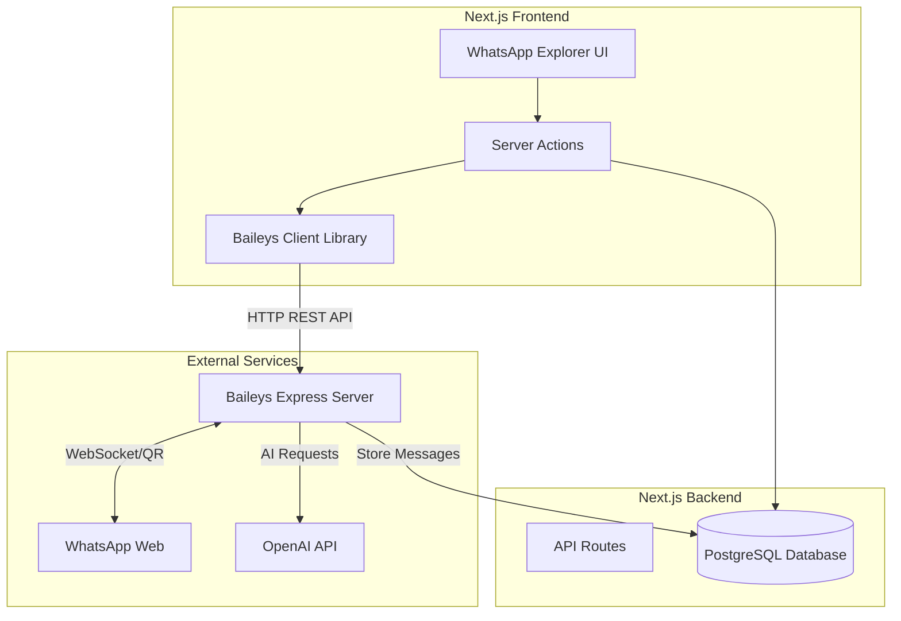
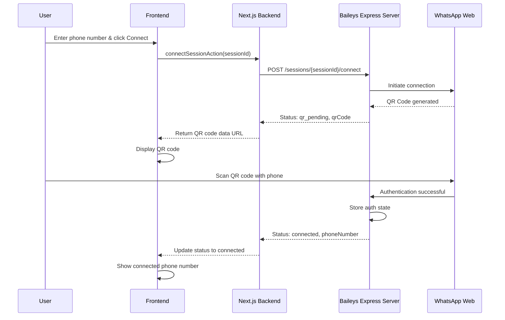
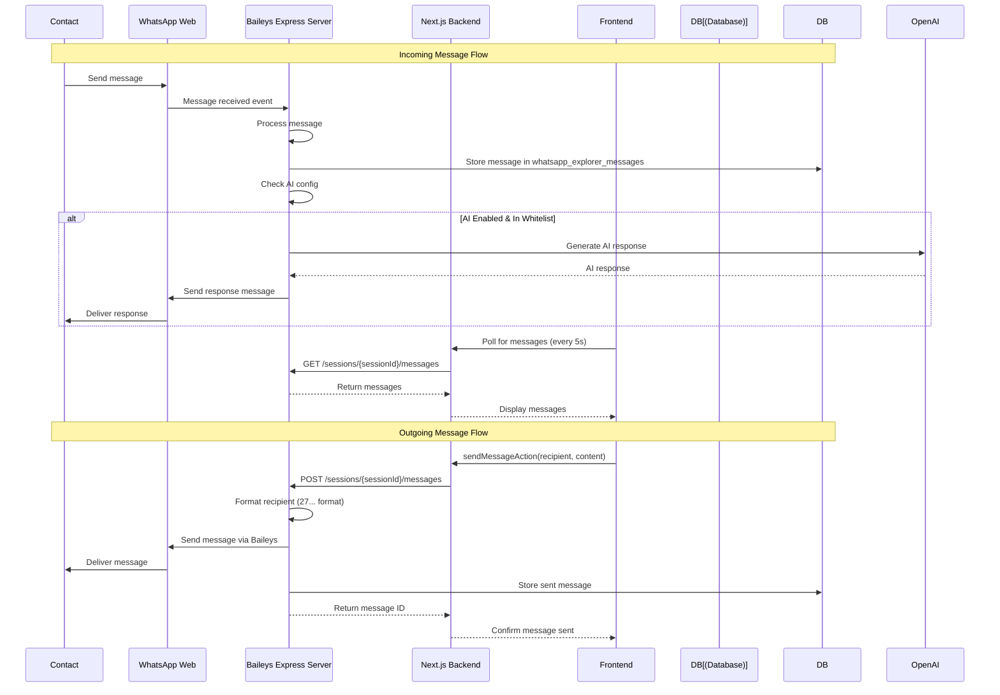
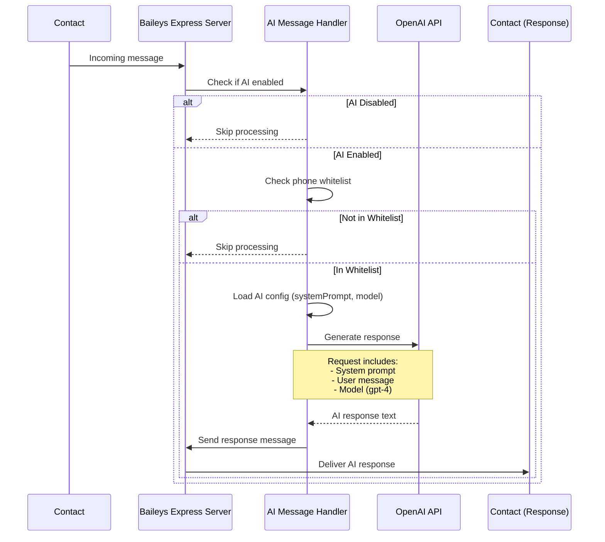
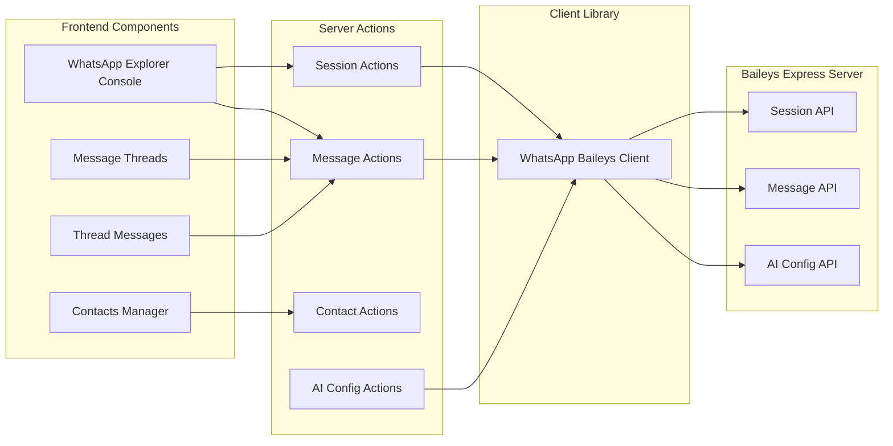
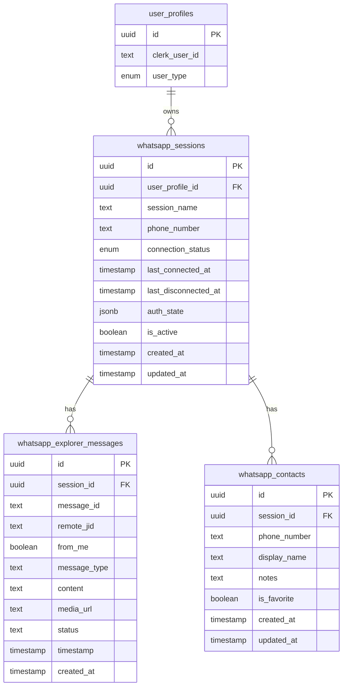

# WhatsApp Baileys Architecture Documentation

This document explains how the WhatsApp Baileys integration works, including authentication, message handling, and AI auto-response functionality.

## Overview

The WhatsApp integration uses a standalone Express.js server (Baileys server) that handles WhatsApp connections via the Baileys library. The Next.js frontend communicates with this server via REST API calls.

## System Architecture

## Authentication Flow

The authentication process uses QR code scanning to link a WhatsApp account:

### Key Steps:

1. **Session Creation**: A WhatsApp session is created in the database for the user
2. **Connection Initiation**: Frontend calls the Baileys server to start connection
3. **QR Code Generation**: Baileys server generates a QR code for WhatsApp Web authentication
4. **QR Code Display**: Frontend polls for status and displays QR code when available
5. **QR Code Scanning**: User scans QR code with their WhatsApp mobile app
6. **Authentication**: WhatsApp Web authenticates and stores credentials in Baileys server
7. **Connection Complete**: Status updates to "connected" and phone number is stored

## Message Flow

Messages flow through the Baileys server which acts as a bridge between WhatsApp Web and the application:

### Message Storage

- **Incoming Messages**: Stored in `whatsapp_explorer_messages` table with `fromMe: false`
- **Outgoing Messages**: Stored in `whatsapp_explorer_messages` table with `fromMe: true`
- **Message Format**: `remoteJid` contains phone number in format `27788307321@s.whatsapp.net`

## AI Auto-Response Flow

The AI auto-responder processes incoming messages and generates responses using OpenAI:

### AI Configuration

- **Storage**: AI config stored in Baileys server (not in database)
- **Configuration**: Set via `updateAiConfig` API endpoint
- **Parameters**:
  - `enabled`: Boolean to enable/disable auto-response
  - `systemPrompt`: Custom prompt for AI behavior
  - `model`: OpenAI model (from `OPENAI_MODEL` env var)
  - `openaiApiKey`: API key (from `OPENAI_API_KEY` env var)
  - `allowedPhoneNumbers`: Whitelist of phone numbers (optional)

### AI Response Process

1. **Message Received**: Baileys server receives incoming message
2. **AI Check**: Server checks if AI is enabled for the session
3. **Whitelist Check**: If whitelist exists, verify sender is in whitelist
4. **AI Request**: Send message + system prompt to OpenAI
5. **Response Generation**: OpenAI generates response based on system prompt
6. **Message Send**: Baileys server sends AI response back to sender

## Component Interactions

## Database Schema

### WhatsApp Sessions

## Key Concepts

### Session Management

- Each user has one or more WhatsApp sessions
- Sessions are identified by `sessionId` (UUID)
- Sessions store authentication state in `authState` JSONB field
- Phone number is stored after successful connection

### Message Threading

- Messages are grouped by `remoteJid` (contact's phone number)
- Each unique `remoteJid` represents a conversation thread
- Threads can be associated with saved contacts for better organization

### Phone Number Format

- **Storage Format**: `27...` (country code without +)
- **WhatsApp Format**: `27788307321@s.whatsapp.net` (remoteJid)
- **Display Format**: Can show as `0821234567` or `+27821234567`
- **Normalization**: Input formats are converted to `27...` format

### AI Auto-Response

- **Configuration**: Per-session basis
- **Whitelist**: Optional list of allowed phone numbers
- **Environment Variables**: 
  - `OPENAI_API_KEY`: Required for AI functionality
  - `OPENAI_MODEL`: Model to use (defaults to `gpt-4`)
- **System Prompt**: Customizable per session

## API Endpoints (Baileys Server)

### Session Management
- `GET /sessions/{sessionId}/status` - Get session status and QR code
- `POST /sessions/{sessionId}/connect` - Initiate connection
- `POST /sessions/{sessionId}/disconnect` - Disconnect session
- `POST /sessions/{sessionId}/logout` - Logout and clear auth

### Messages
- `GET /sessions/{sessionId}/messages` - Get messages (with pagination)
- `POST /sessions/{sessionId}/messages` - Send a message

### AI Configuration
- `GET /sessions/{sessionId}/ai-config` - Get AI configuration
- `PUT /sessions/{sessionId}/ai-config` - Update AI configuration
- `POST /sessions/{sessionId}/test-ai` - Test AI response

## Error Handling

- **Connection Errors**: Displayed in UI with error messages
- **Message Send Failures**: Logged and returned to frontend
- **AI Errors**: Caught and logged, don't block message storage
- **Network Errors**: Retry logic in Baileys server

## Security Considerations

- **API Key**: Required for all Baileys server requests
- **Session Isolation**: Each user's sessions are isolated by `userProfileId`
- **Auth State**: Stored securely in database (encrypted by Baileys)
- **Phone Number Privacy**: Phone numbers normalized and stored securely

