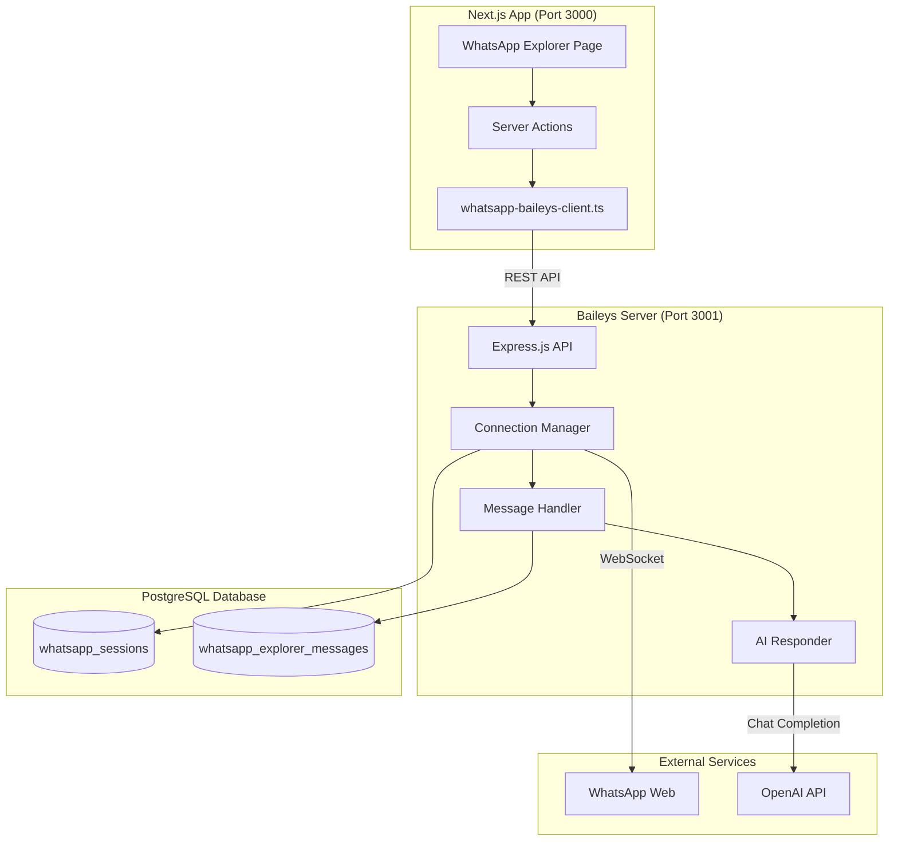
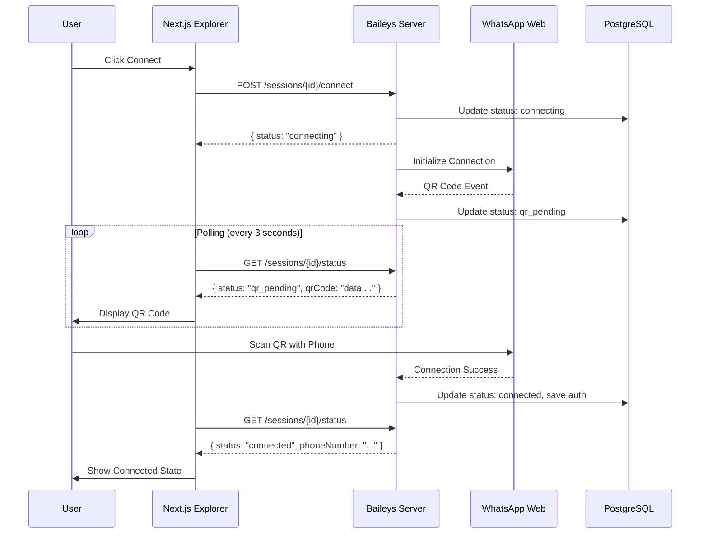
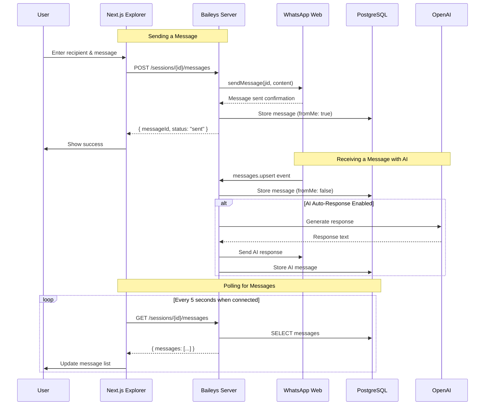
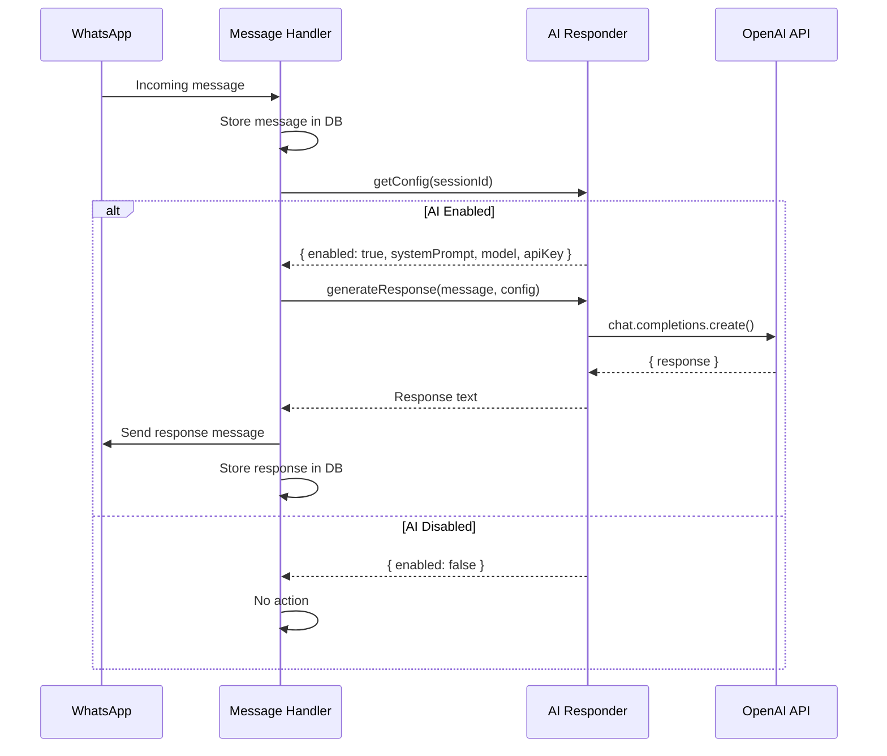
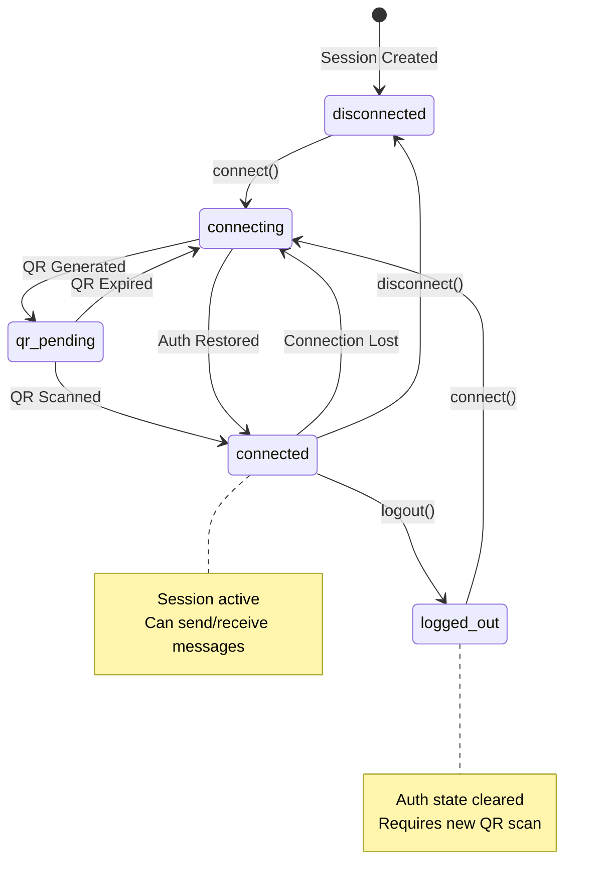
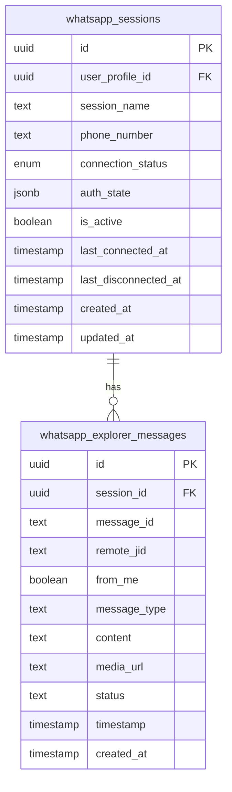
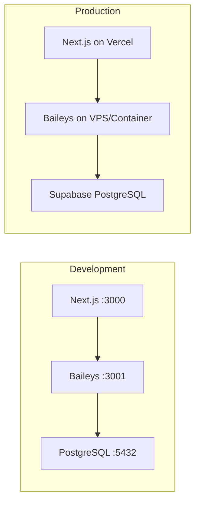

# WhatsApp Baileys Integration Architecture

This document describes the architecture and integration patterns for the WhatsApp Baileys server and its integration with the Rental Agent AI Next.js application.

## System Architecture

## Connection Flow

## Message Flow

## AI Response Flow

## Session State Machine

## Database Schema

## Component Responsibilities

### Baileys Server Components

| Component | Responsibility |
|-----------|---------------|
| **Connection Manager** | Singleton managing all WhatsApp sessions, handles connect/disconnect, QR generation, reconnection logic |
| **Message Handler** | Processes incoming/outgoing messages, stores in database, triggers AI responses |
| **AI Responder** | Manages AI configuration per session, generates OpenAI responses |
| **Auth State** | Persists Baileys authentication credentials to PostgreSQL |

### Next.js Components

| Component | Responsibility |
|-----------|---------------|
| **whatsapp-baileys-client.ts** | HTTP client library for Baileys server API |
| **whatsapp-explorer-actions.ts** | Server actions that wrap client library calls |
| **whatsapp-explorer-console.tsx** | UI component with tabs for connection, messaging, AI config |

## Communication Patterns

### REST API
- All commands (connect, send, configure) use REST API
- Simple request/response model
- Error handling via HTTP status codes

### Polling
- QR code updates: 3-second intervals during connection
- Message updates: 5-second intervals when connected
- Status updates: Manual refresh or automatic during connection

### Future Enhancements
- Server-Sent Events (SSE) for real-time message streaming
- WebSocket for bidirectional communication
- Webhook callbacks for message events

## Security Considerations

1. **API Key Authentication**: All endpoints (except health) require valid API key
2. **CORS**: Restricted to Next.js app URL only
3. **Credential Storage**: Auth state stored in database, never exposed via API
4. **Input Validation**: Phone numbers and messages validated before processing
5. **Rate Limiting**: Consider adding for production use

## Deployment Considerations

### Production Requirements
- Baileys server needs persistent connection (not serverless)
- Consider using PM2 or Docker for process management
- Ensure database connection pooling is configured
- Set up monitoring for connection health
